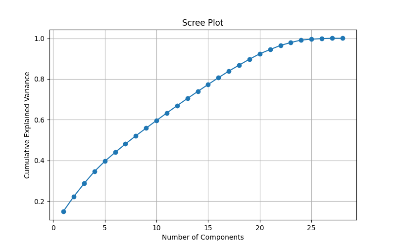
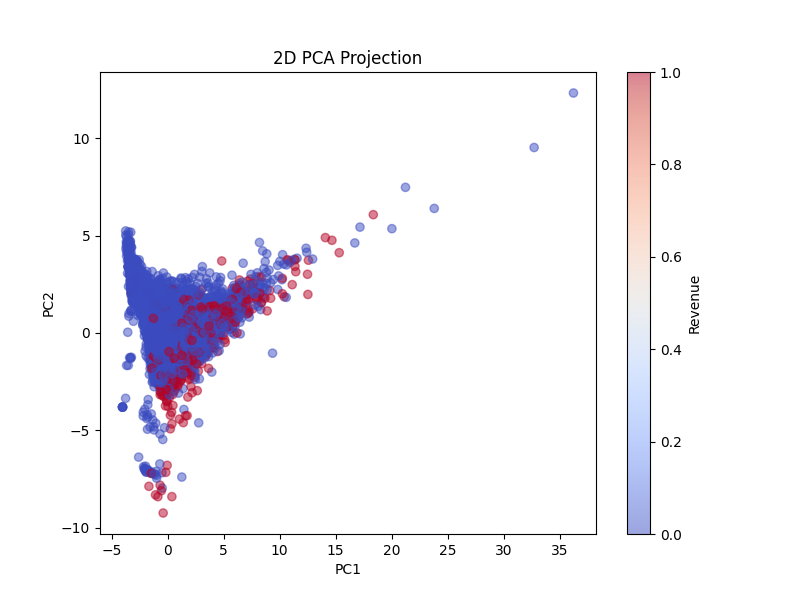
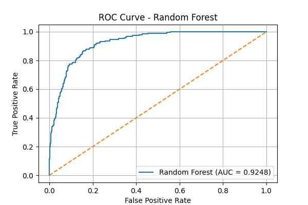
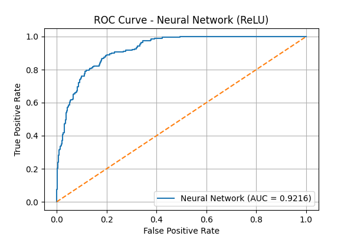
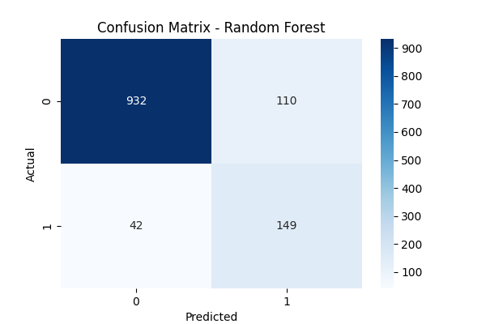
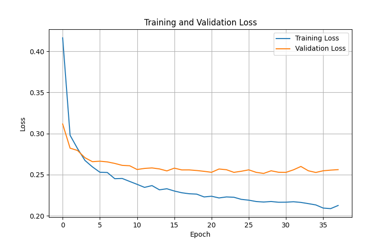

Εργασία AI-HANDSON

## 1. Περιγαφή προβλήματος
Το πρόβλημα που επιλεχτηκε αφορά την πρόβλεψη συμπεριφοράς χρηστών σε ένα e-commerce περιβάλλον. Πρόκειται για ένα πρόβλημα δυαδικής ταξινόμησης(binary classification)
Στόχος είναι να προωλεφθεί η μεταβλητή Revenue, η οποία δείχνει αν ένας χρήστης πραγματοποίησε αγορά(1) ή όχι(0).
Η πρόβλεψη αυτή είναι χρήσιμη γιατί μπορεί να βοηθήσει επιχειρήσεις να βελτιώσουν τις στρατηγικές marketing που εφαρμόζουν κι έτσι να αυξήσουν τις πωλήσεις τους.

## 2. Περιγαφή δεδομένων 
Πηγή δεδομένων: https://archive.ics.uci.edu/ml/datasets/Online+Shoppers+Purchasing+Intention+Dataset
Το dataset περιλαμβάνει συνδερίες χρηστών σε ηλεκτρονικό κατάστημα
αριθμός παρατηρήσεων-> 12.000
αριθμός χαρακτηριστικών-> 18
Κάθε γραμμή αντιστοιχεί σε μία συνεδρία χρήστη. Τα χαρακτηριστικά περιλαμβάνουν:
Μετρήσεις αλληλεπίδρασης (PageValues, BounceRates, ExitRates)
Συμπεριφορά χρήστη σε προϊόντα.

## 3. Προεπεξεργασία
Η προεπεξεργασία των δεδομένων περιλάμβανε τα εξής στάδια:

**Missing values:**
Οι αριθμητικές μεταβλητές συμπληρώθηκαν με τη διάμεσο (median), ενώ οι κατηγορικές μεταβλητές με τη συχνότερη τιμή (mode). Οι τιμές αυτές υπολογίστηκαν αποκλειστικά από το training set και στη συνέχεια εφαρμόστηκαν και στα validation και test sets, ώστε να αποφευχθεί data leakage.

**Outliers:**
Δεν εφαρμόστηκε κάποια συγκεκριμένη τεχνική αφαίρεσης outliers. Τα δέντρα αποφάσεων (Random Forest) είναι ανθεκτικά σε ακραίες τιμές.

**Encoding:**
Οι κατηγορικές μεταβλητές μετατράπηκαν σε αριθμητική μορφή μέσω one-hot encoding (`pd.get_dummies` με `drop_first=True`). Μετά το encoding έγινε ευθυγράμμιση των χαρακτηριστικών μεταξύ training, validation και test set ώστε να έχουν τις ίδιες στήλες.

**Scaling:**
Εφαρμόστηκε κανονικοποίηση με StandardScaler, ώστε τα χαρακτηριστικά να έχουν μέση τιμή 0 και διασπορά 1.
Τέλος, όλες οι στατιστικές ποσότητες (median, mode, scaling parameters) υπολογίστηκαν αποκλειστικά από το training set και στη συνέχεια εφαρμόστηκαν στα υπόλοιπα σύνολα, διασφαλίζοντας σωστή πειραματική διαδικασία χωρίς data leakage.

## 4. Feature Engineering
Δημιουργήθηκαν νέα χαρακτηριστικά:

**Engagement**: μετρά το επίπεδο αλληλεπίδρασης του χρήστη
Το χαρακτηριστικό αυτό ορίστηκε ως το άθροισμα των ProductRelated και Informational και μετρά το επίπεδο αλληλεπίδρασης του χρήστη με το περιεχόμενο της ιστοσελίδας. Υψηλότερες τιμές υποδηλώνουν μεγαλύτερη εμπλοκή του χρήστη.

**Duration_per_page**
Το χαρακτηριστικό αυτό υπολογίστηκε ως ProductRelated_Duration / (ProductRelated + 1) και εκφράζει τον μέσο χρόνο που αφιερώνει ο χρήστης ανά σελίδα προϊόντος. Η προσθήκη του +1 στον παρονομαστή εξασφαλίζει ότι αποφεύγεται διαίρεση με το μηδέν σε περιπτώσεις όπου το ProductRelated είναι 0.

## 5. PCA Insights

**Scree Plot:**
Το scree plot δείχνει ότι η διακύμανση εξηγείται σταδιακά από περισσότερα principal components και δεν συγκεντρώνεται σε πολύ λίγα. Δεν παρατηρείται έντονο “elbow”, γεγονός που υποδηλώνει ότι η πληροφορία του dataset είναι κατανεμημένη σε πολλά χαρακτηριστικά και δεν υπάρχει ένα μικρό σύνολο features που να εξηγεί το μεγαλύτερο μέρος της διακύμανσης.

### Scree Plot


**Dominant Features:**
Από την ανάλυση των PCA loadings προκύπτει ότι τα σημαντικότερα χαρακτηριστικά για το πρώτο principal component είναι τα εξής:

- Engagement (0.42)
- ProductRelated (0.42)
- ProductRelated_Duration (0.41)
- Administrative (0.32)
- Informational (0.30)
- Administrative_Duration (0.26)
- ExitRates (0.26)
- Informational_Duration (0.25)

Παρατηρείται ότι τα χαρακτηριστικά με τη μεγαλύτερη συνεισφορά σχετίζονται κυρίως με τη δραστηριότητα και τη συμπεριφορά του χρήστη μέσα στο e-commerce site.

**2D Projection:**
Η προβολή των δεδομένων στα δύο πρώτα principal components δείχνει έναν μερικό διαχωρισμό μεταξύ των δύο κλάσεων (αγορά / μη αγορά), αλλά όχι πλήρη. Οι δύο κατηγορίες παρουσιάζουν επικάλυψη, γεγονός που υποδηλώνει ότι το πρόβλημα δεν είναι γραμμικά separable μόνο με αυτά τα δύο components.

### 2D PCA Projection


Συνεπώς, απαιτούνται πιο σύνθετα μοντέλα (όπως Random Forest ή Neural Networks) για την αποτελεσματική ταξινόμηση των δεδομένων.

## 6. Σύγκριση Μοντέλων

Στην εργασία εκπαιδεύτηκαν και αξιολογήθηκαν δύο μοντέλα:

* Random Forest
* Νευρωνικό Δίκτυο (ReLU)

### Αποτελέσματα:

| Μοντέλο        | Accuracy | Precision | Recall | F1-score | ROC-AUC |
| -------------- | -------- | --------- | ------ | -------- | ------- |
| Random Forest  | 0.8767   | 0.5753    | 0.7801 | 0.6622   | 0.9248  |
| Neural Network | 0.8897   | 0.6774    | 0.5497 | 0.6069   | 0.9170  |

  


Η ROC καμπύλη απεικονίζει τη σχέση μεταξύ True Positive Rate (recall) και False Positive Rate για διαφορετικά thresholds. Παρατηρείται ότι το Random Forest παρουσιάζει ελαφρώς καλύτερη καμπύλη, γεγονός που επιβεβαιώνει το υψηλότερο ROC-AUC και την καλύτερη ικανότητα διάκρισης των δύο κλάσεων.

### Confusion Matrix (Random Forest)



Ο πίνακας σύγχυσης δείχνει την απόδοση του μοντέλου στις δύο κλάσεις.


### Training & Validation Loss



Η καμπύλη loss δείχνει ότι το μοντέλο συγκλίνει και σταθεροποιείται μετά από αρκετές εποχές, χωρίς έντονα σημάδια overfitting.

### Ανάλυση

Παρατηρείται ότι το νευρωνικό δίκτυο παρουσιάζει ελαφρώς υψηλότερη ακρίβεια (accuracy), όμως το Random Forest υπερτερεί σε σημαντικότερες μετρικές όπως το recall και το ROC-AUC.

Το υψηλότερο recall του Random Forest δείχνει ότι εντοπίζει περισσότερες περιπτώσεις πραγματικών αγορών, κάτι που είναι ιδιαίτερα σημαντικό σε αυτό το πρόβλημα. Παράλληλα, το υψηλότερο ROC-AUC υποδηλώνει καλύτερη συνολική ικανότητα διάκρισης μεταξύ των δύο κλάσεων.

Το νευρωνικό δίκτυο παρουσιάζει χαμηλότερο recall, γεγονός που σημαίνει ότι χάνει αρκετές θετικές περιπτώσεις (αγορές), παρόλο που έχει καλύτερη precision.

Επιπλέον, η καμπύλη loss του νευρωνικού δικτύου δείχνει ότι η εκπαίδευση σταθεροποιείται μετά από αρκετές εποχές, γεγονός που υποδηλώνει ότι το μοντέλο μαθαίνει, αλλά δεν καταφέρνει να γενικεύσει καλύτερα από το Random Forest.

### Συμπέρασμα

Το Random Forest παρουσιάζει καλύτερη συνολική απόδοση και θεωρείται το καταλληλότερο μοντέλο για το συγκεκριμένο πρόβλημα.
Το αποτέλεσμα δεν είναι ιδιαίτερα εκπληκτικό, δεδομένου του μεγέθους και της φύσης του dataset. Τα νευρωνικά δίκτυα αποδίδουν καλύτερα σε πολύ μεγάλα datasets ή σε πιο σύνθετες δομές δεδομένων (όπως εικόνες ή κείμενο). Αντίθετα, για δεδομένα σε μορφή πίνακα, όπως αυτά της συγκεκριμένης εφαρμογής, μοντέλα όπως το Random Forest συχνά επιτυγχάνουν καλύτερη απόδοση. Συνεπώς, το γεγονός ότι το Random Forest υπερέχει είναι αναμενόμενο.

## 7. Επιλογή Καλύτερου Μοντέλου

Ως καλύτερο μοντέλο επιλέχθηκε το **Random Forest**, το οποίο αποθηκεύτηκε στο αρχείο `best_model.pkl`.

Η επιλογή βασίζεται στην καλύτερη συνολική απόδοση του μοντέλου, όπως φάνηκε από τα αποτελέσματα της αξιολόγησης στο test set.

## 8. Εγκατάσταση & Εκτέλεση

Για να εκτελεστεί το project, ακολουθούνται τα παρακάτω βήματα:

1. Μεταβαίνουμε στον φάκελο της εργασίας:

```bash
cd hw1
```

2. Εγκαθιστούμε τις απαραίτητες βιβλιοθήκες:

```bash
pip install -r requirements.txt
```

3. Εκτελούμε το πρόγραμμα:

```bash
python main.py
```

Το πρόγραμμα εκτελεί όλη τη διαδικασία (preprocessing, εκπαίδευση μοντέλων και αξιολόγηση) και εμφανίζει τα αποτελέσματα.


